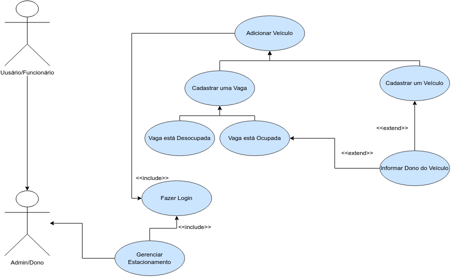

# Projeto Integrador - ParkItU

Documentação para o desenvolvimento do Projeto Integrador do Curso de Técnico em Desenvolvimento de Sistemas para a Internet Integrado ao Ensino Médio do IFC - Campus Araquari.

Estudantes: [Eduardo Barbaro](github.com/dudubarbaro) e [Brunno Duarte da Cunha](https://github.com/BrunnoDC).

Links do projeto:

-   [Documentação](github.com/dudubarbaro/pi-modelo)
-   [Backend](github.com/ParkItU/backendParkItU)
-   [Frontend](github.com/ParkItU/ParkItUWeb)

# Empréstimo

Gerenciamento de um estacionamento

  Com o crescimento e procura por vagas para os veículos de nossa região, tivemos a ideia de desenvolver um sisrtema de gerenciamento e desenvolvimento digital para estacionamentos de veículos.
  Assim, atualmente, conseguiremos fazer com que os donos de garagens concentrem seus esforços na melhora da sua gestão. Para isso, apresentamos, um sistema de controle de que permita monitorar a entrada e saída de veículos dos estabelecimentos. Como nossa intenção é melhorar a gestão do negócio, é muito importante que consigamos ter relatórios, como por exemplo, numero de ingressos e egressos mensais.

# Situação Problema

  O cliente conhece nosso sistema por meio de nossos conteúdos digitais em nossas redes sociais, indicações ou até por propagandas/ convênios e folhetos impressos. A fim de melhorar o gerenciamente de seu estacionamento , deixando os carros em segurança, com a ideia de alocar, cotar ou apenas verificar uma vaga, dependendo do que o seu cliente procura.
  Na implementação do sistema, apresentamos as garagens daquele perfil de dono, carros que estão nessa garagem e a quantidade de vagas ainda disponíveis.
  Entretanto, a atualização é feita de maneira manual e por conta do usuário. Com a locação da vaga finalizada, local liverado, a vaga é aberta novamente para a adição de um novo veículo.
  Com isso notamos alguns problemas em relação ao gerenciamento dos veículos no pátio, controle de entrada e saída dos automóveis e divulgações para vendas em redes sociais, por serem muito fechadas ao seu público alvo nativo. 
  Já atuando na resolução desses problemas, escolhemos por obter o desenvolvimento de um software de gerenciamento para nos ajudar a manter o maior controle e segurança dos veículos de nossos clientes, principalmente, com um domínio próprio na internet, uma maior liberdade de divulgação e modernidade à nossa empresa.

# Descrição da proposta

O desenvolvimento do predicado software advém da necessidade da situação-problema que se caracteriza com a relação ao gerenciamento dos veículos no pátio, controle de entrada e saída dos automóveis e divulgações para vendas em redes sociais, por serem muito fechadas ao seu público alvo nativo.
Para isso o sistema terá seu foco no gerenciamento de veículos. O sistema permitirá a adição e a remoção de veículos, controle do patio e das vagas, relatório de entrada e a saída de veículos. Dois níveis de usuário: Admin/Dono e Usuário/Funcionário. O Admin/Dono terá acesso as telas do seu estabelecimento e o controle, relatório e registro de entrasdas e saídas; Adição, Remoção e Atualização das vagas e informações dos veículos. O usuário Cliente/Funcionário terá acesso a tela de visualização das vagas disponíveis e do status referenteas vagas; Adição, Remoção e Atualização das vagas e informações dos veículos.

# Regras de Negócio

**RN01 - Alocação de Veículo e Vaga:** A alocação de veículo requer uma vaga disponível, previamente definida pelo Admin/Dono.  
**RN02 - Adição de Veículo:** Para adicionar um veículo, informações necessárias incluem nome do veículo, nome do dono, número de celular, placa, data e hora de entrada, data e hora de saída, e a vaga disponível. Após o cadastro, o status do veículo é ocupando uma vaga. 
**RN03 - Cadastro de Usuários:** O perfil Admin/Dono pode cadastrar um novo usuário, fornecendo um email e senha para login.  
**RN04 - Ocupação de Vaga:** Um veículo pode ocupar uma vaga somente se estiver disponível, e a adição da vaga é realizada por usuários cadastrados. 
**RN05 - Registro de Gerenciamento:** O Admin/Dono tem acesso aos registros de veículos e vagas para gerenciamento. 
**RN06 - Desocupação de Vaga:** Quando um veículo desocupa uma vaga, o usuário deve adicionar a data e hora de saída para um futuro relatório. O veículo é então desassociado da vaga, permitindo que a vaga seja considerada desocupada. 
**RN07 – Impressão de Relatório de Vagas:** Após o registro das informações das vagas, o Usuário/Funcionário deve submeter o relatório ao Admin/Dono para aprovação em até um dia. Se o relatório estiver correto, o Admin/Dono pode aprovar o relatório diário com sua assinatura online. 
**RN08 – Abertura de OS:** Quando um Usuário/Funcionário adiciona a ocupação de uma vaga, os dados são enviados ao Admin/Dono para gerenciamento interno, resultando na ocupação da vaga. 
**RN09 – Gerenciamento de Fluxo de Vagas e Veículos:** Apenas o Admin/Dono pode gerenciar o fluxo de veículos e vagas.

# Requisitos Funcionais

**RN01 - Processo que o Usuário/Funcionário tem ao cadastrar um veículo:** Para validar a alocação de um veículo, é de suma importância ter uma vaga disponível, a mesma é préviamente setada pelo Admin/Dono nas informçãoes di seu estabelecimento.  
**RN02 - Usuário/Funcionário adiciona um veículo:**  Para cadastrar/adicionar um veículo, é necessário obter-se algumas informações, como nome do veículo, nome do dono do veículo e seu número de celular, placa do veículo, data e hora de enrtada e posteriormente a sáida; e a vaga disponível. Com o veículo cadastrado no sistema, seu status será como ocuoando um vaga. 
**RN03 - Cadastro de usuários:** O perfil Admin/Dono pode cadastrar um novo usuário,informando um email e senha para login. 
**RN04 - Ocupar vaga:** Para um veículo ocupar uma vaga, a mesma deve estar liberada e a adição da vaga ao carro é feita apenas por usuários cadastrados. 
**RN05 - Registro de Gerenciamento:** O Admin/Dono deve possuir acesso aos gerenciamentos de veículos e vagas 
**RN06 - Desocupar um vaga:** No momento em que se refere ao veículo desocupar uma vaga, o usuário deverá realiazar a adição da data e hora de saída para um posterior relatório, e desatribuir o veículo de sua vaga, permitindo que o status da vaga agora seja descupada. 
**RN07 – Impressão do relatório de vagas:** Com as informações das vagas registradas, o Usuário/Funcionário deve enviar ao Admin/Dono para aprovação no período de um dia, caso relatório confirme as informações, o mesmo poderá, com a sua assinatura online, aprovar o relatorio diário. 
**RN08 – Abertura de OS:** Com vaga ocupada for adicionada pelo Usuário/Funcionário, o Admin/Dono deverá receber os dados fornacidos pelo usuário em uma tela, para o gerenciamento interno, realizando a ocupação de uma vaga. 
**RN09 – Gerenciamento de fluxo de vagas e veículos:** O gerenciamento de fluxo de veículos será permitido somente para o Admin/Dono.

# Requisitos Não Funcionais

**RNF01 - Confiabilidade:** O sistema deve ser confiável, garantindo a disponibilidade e a integridade dos dados registrados, além de operar sem falhas frequentes. 
**RNF02 - Desempenho:** O sistema deve ser capaz de lidar com um grande número de veículos, processando as transações de entrada e saída forma rápida e eficiente. 
**RNF03 -Segurança:** O sistema deve garantir a segurança das informações dos usuários, dados, criptografia e controle de acesso. 
**RNF04 -Usabilidade:** O sistema deve ser fácil de usar e intuitivo, tanto para os funcionários responsáveis pela operação do estacionamento quanto para os administradores que utilizam o serviço. 
**RNF05 - Escalabilidade:** O sistema deve ser capaz de lidar com um aumento na demanda sem comprometer o desempenho, permitindo a expansão do estacionamento sem grandes dificuldades. 
**RNF06 - Integração:** O sistema deve ser capaz de se integrar com outros sistemas, como sistemas de controle de acesso, sistemas de pagamento e sistemas de gestão financeira. 
**RNF07 - Manutenibilidade:** O sistema deve ser facilmente mantido e atualizado, permitindo a correção de falhas, a incorporação de novas funcionalidades e a aplicação de melhorias quando necessário.

# Diagrama de Caso de Uso

# MER

